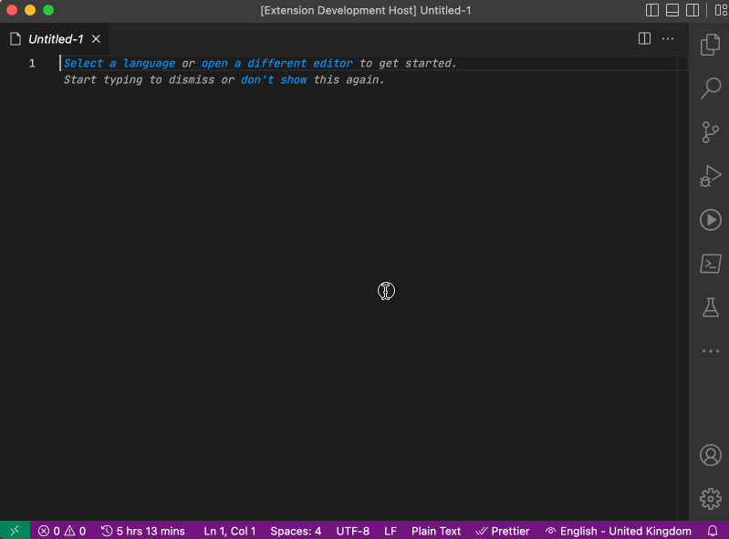

# .env Manager

Do you use `.env` files to manage your environment variables in your local dev environment? Use this extension to quickly add values to `.env` file, either selecting a text or running the command. Checkout the quick demo of its working below.

## Usage

