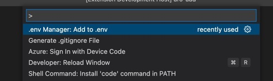
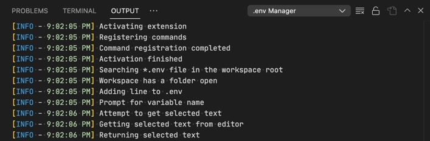

# .env Manager

Do you use `.env` files to manage your environment variables in your local dev environment? Use this extension to quickly add values to `.env` file, either selecting a text or running the command. Checkout the quick demo of its working below.

## Usage

The extension exposes a command called `.env Manager: Add to .env`. The command is available in VS Code "Command Palette" which you can also access using shortcut <kbd>Cmd</kbd> + <kbd>Shift</kbd> + <kbd>P</kbd> on Mac.

Alternatively you can also right click on any active editor and select `.env Manager: Add to .env` from the context menu.

If the folder does not contain `.env` file at the root, the extension attempts to create it before adding the line.

> Please see: 
> 1. Make sure you backup your .env file if you have very important secrets in the .env file.
> 2. Never commit your .env file in to source control.

## Reporting issues

The extension pushes the logs in to its own Output channel called, `.env Manager`. If you encounter any issues, raise the issue in GitHub repo and paste the contents of Output channel for analysis and easy troubleshooting.

